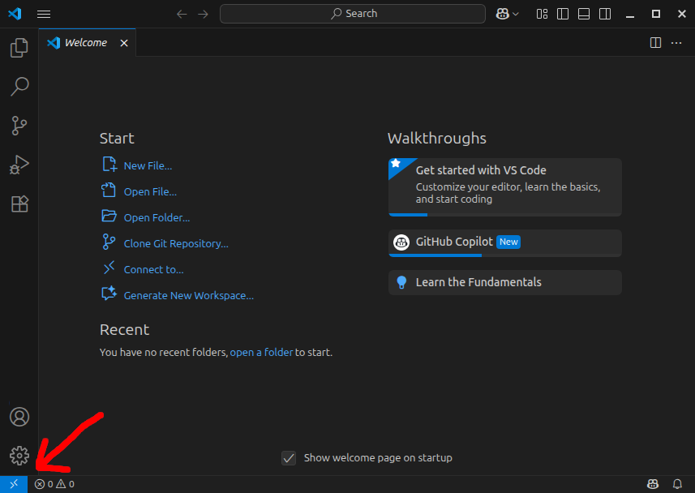
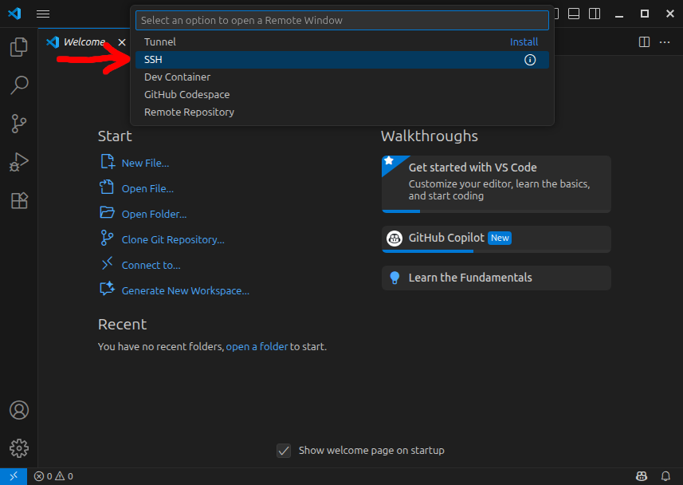
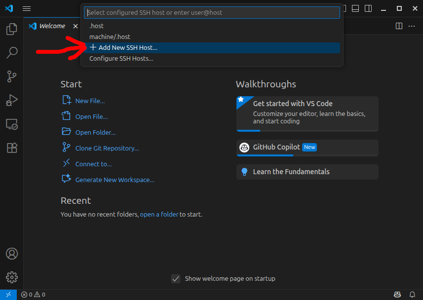
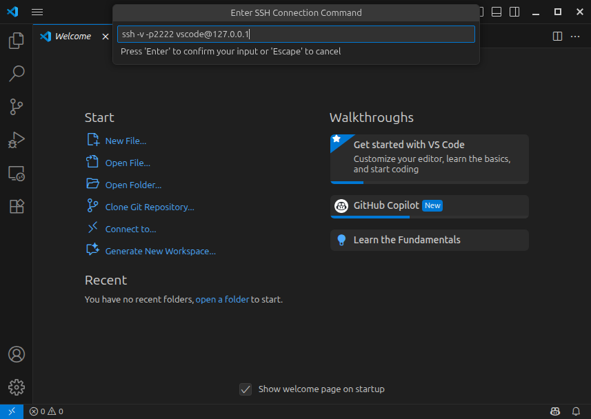
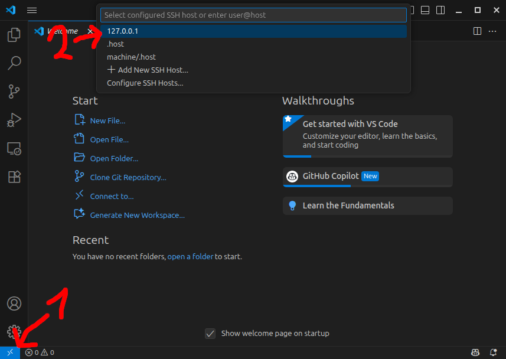
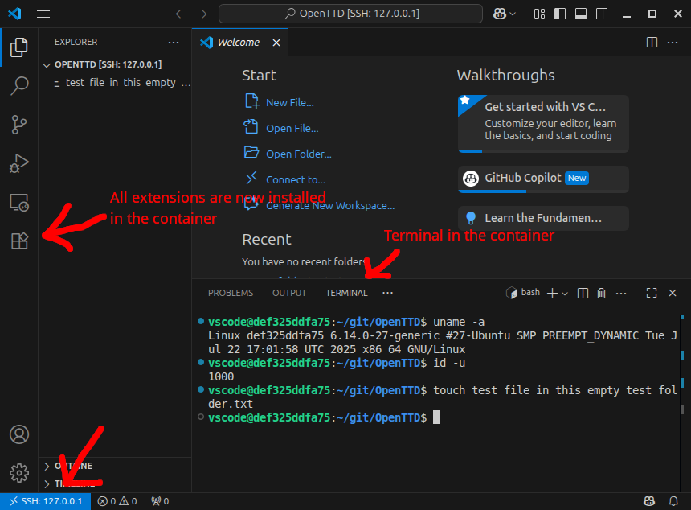

# devcontainer
A hardened dev environment in a container. For use with vscode. Via ssh; not containers.dev.


## Setup

At the example of mounting `~/git/OpenTTD` into the container.

We assume rootless podman.

```sh
$ cp ~/.ssh/id_ed25519.pub .
$ podman build -t devcontainer-deb-ssh-image .
$ podman run --name devcontainer-deb-ssh -p 127.0.0.1:2222:22 --user 0:0 --userns keep-id:uid=1000,gid=1000 --mount type=bind,src=${HOME:?}/git/OpenTTD,target=/home/vscode/git/OpenTTD -d devcontainer-deb-ssh-image
```


Options explained
* The sshd in the container is bound to `127.0.0.1:2222`, not externally reachable.
* By default, we run the sshd as root, so we need `--user 0:0`.
* But we want to be able to access `/home/vscode/git/OpenTTD` as the `vscode` user.
  The `--userns keep-id:uid=1000,gid=1000` maps our local host user to the container uid 1000 (hard-coded in the Dockerfile), so the mounted `${HOME:?}/git/OpenTTD` is effectively owned by the same non-root user in the host and in the container.
  (thanks [reddit](https://www.reddit.com/r/podman/comments/103ut7z/explain_it_like_im_5_whats_the_recommended_way_of/))
  


## Starting

```sh
$ podman start devcontainer-deb-ssh
```

Debug that the container is up:

```sh
$ ssh -v -p2222 vscode@127.0.0.1
```

Manage (root shell):

```sh
$ podman exec -it devcontainer-deb-ssh /bin/bash
```

## Connect VS Code.














## TODO  Example to build openttd

```sh
$ podman exec -it devcontainer-deb-ssh /bin/bash
root@container:/# apt update && apt install -y --no-install-recommends bzip2 ca-certificates cmake git gnupg2 libc6-dev libfile-fcntllock-perl libfontconfig-dev libicu-dev liblzma-dev liblzo2-dev libsdl1.2-dev libsdl2-dev libxdg-basedir-dev make software-properties-common tar wget xz-utils zlib1g-dev
```

and run in bubblewrap
